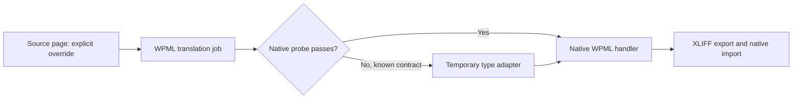

<p align="center"></p>

# WPML Elementor V4 Component Translation Fix

**Component override text missing from your WPML XLIFF export?** This small WordPress plugin adapts explicit Elementor V4 `escaped-html` overrides through WPML's native translation handler, then gets out of the way when native support passes its checks.

[](https://github.com/enuzzo/wpml-elementor-component-fix/actions/workflows/tests.yml)
[](https://github.com/enuzzo/wpml-elementor-component-fix/releases/latest)
[](LICENSE)
[](.github/workflows/tests.yml)

**[Download the installable plugin →](https://github.com/enuzzo/wpml-elementor-component-fix/releases/latest)** · [How it works](docs/architecture.md) · [Guida italiana](docs/README.it.md) · [Report a compatibility issue](https://github.com/enuzzo/wpml-elementor-component-fix/issues/new/choose)

Built by **Netmilk Studio**. Temporary by design, reusable across sites. Independent community project; not affiliated with or endorsed by WPML or Elementor.

## The symptom

You build a reusable Elementor V4 component, override a heading or button label in a page instance, and send the page through WPML. Links may appear in the export, while the overridden text does not. An exported component job may contain only its document title. Translating those available fields cannot translate text that was never exported.

This adapter targets **explicit instance text overrides stored as `escaped-html`**, when the installed native handler understands the corresponding `string` format but misses this value type. It does not register every kind of Elementor field.

## What it changes

| Behavior | Result |
| --- | --- |
| Explicit `escaped-html` text overrides | Exposed through the native WPML extraction/import handler |
| Elementor source data | Adapted in an in-memory copy; original value type restored in the returned update |
| Translation field identifiers and links | Delegated to the installed WPML handler |
| Working native plain-text **and** HTML round trips | Original native handler retained |
| Unknown or incompatible native API | Original configuration retained |
| Settings, database tables, frontend scripts, network calls, telemetry | None added |

**WPML still owns the translation job and applies the translation.** The plugin does not independently write secondary-language Elementor pages or translate text itself.



## Install and verify

1. Download **`netmilk-wpml-component-compat-1.0.1.zip`** from [Releases](https://github.com/enuzzo/wpml-elementor-component-fix/releases/latest). Use the release asset; GitHub's source-code ZIP contains the repository, not an installable plugin at its root.
2. In WordPress, open **Plugins → Add New → Upload Plugin**, upload the ZIP and activate **Netmilk — WPML Elementor Component Fix**.
3. Start with a draft source page containing two component instances with different explicit text overrides. Keep a backup and use your normal WPML local-translator workflow.
4. Create **fresh translation jobs**, export XLIFF 1.2, and confirm that the expected source texts are present. Existing exports do not gain missing fields retroactively.
5. Translate the `<target>` values, preserve the sources, identifiers and meaningful markup, then import through **WPML → Translations**.
6. Check the rendered translated page: texts, links, device layouts and inherited properties. An accepted ZIP alone is not proof of a correct page.

This flow needs no Advanced Translation Editor or automatic translation. If a field still does not appear, diagnose the source/property/job before changing anything in a translated Elementor page.

Updates are manual through GitHub release ZIPs. The plugin does not install an updater or poll GitHub.

## Requirements and test coverage

| Layer | Coverage |
| --- | --- |
| PHP | Declared minimum 7.4; CI matrix 7.4, 8.1, 8.3 and 8.5 |
| WordPress | Declared minimum 6.5; WordPress runtime not included in the test harness |
| Elementor | V4 `e-component` instances with explicit `escaped-html` overrides |
| WPML | Existing `WPML\PB\Elementor\V4\Component\Overrides` handler using the supported untyped method contract |
| Regression tests | 14 isolated scenarios with original synthetic doubles, covering extraction, import, identities, links, source immutability and conservative fallback |
| Live CMS certification | **Not yet completed for this public release** |

The implementation was informed by a handler contract observed in WPML 4.9.7. Public tests contain original synthetic examples, **not** WPML vendor code or client exports. CI is a PHP/contract check, not a substitute for a real WordPress + Elementor + WPML export/import/render test.

## Remove it when native support works

The plugin checks native plain-text and HTML extraction/import once per request using synthetic data. If both probes pass, it leaves the native handler in place. This is a **bypass**, not automatic deactivation or uninstallation.

After an official update, deactivate the adapter on a test site and run a **fresh** translation cycle against the actual fields you use. If export, native import and the rendered page all work, delete it from Plugins. It owns no persistent data. If native support is still incomplete, future jobs may omit text again after deactivation.

## FAQ

### WPML says Elementor component overrides are fixed. Why another plugin?

The [official component-override erratum](https://wpml.org/errata/elementor-editor-v4-beta-cant-translate-component-property-overrides/) is marked **resolved in WPML 4.9.3**. The [general V4 overview](https://wpml.org/errata/elementor-v4-general-overview/) is marked resolved in 4.9.4. This project addresses a narrower value-format mismatch observed during later integration work. Those statuses do not prove that every component property format works in your installed stack. Use this adapter only when your own fresh export demonstrates the matching symptom.

### Will it translate inherited component defaults?

No. A value inherited from the component master is not an explicit instance override. This plugin does not manufacture overrides or register master-component properties. Diagnose that field's native WPML workflow separately.

### Will it fix every Elementor V4 button or custom widget?

No. It targets `e-component` override values, not all atomic widgets, custom controls, forms or styling. See [WPML's custom Elementor widget documentation](https://wpml.org/documentation/support/multilingual-tools/registering-custom-elementor-widgets-for-translation/) for a different integration problem.

### Can I reuse it across different sites and languages?

Yes, for the same supported contract and data format. There are no embedded site IDs, domains, media, translation strings or language codes. Verify a draft round trip on each stack before using it for production jobs.

### Nothing changed after activation. What should I check?

Confirm the value is an explicit `escaped-html` override, generate a fresh job, and inspect its XLIFF source fields. The adapter intentionally leaves unsupported contracts, an absent native handler and an existing replacement handler alone. Please [report the exact versions and a minimal synthetic reproduction](CONTRIBUTING.md).

## Development

```sh
php tests/run.php
python3 scripts/build.py
```

The build uses an explicit payload allowlist and deterministic ZIP metadata. Output: `dist/netmilk-wpml-component-compat-1.0.1.zip` and `dist/SHA256SUMS`. Release assets contain only the PHP entrypoint, WordPress readme and GPL license, inside one plugin folder.

[Contributing](CONTRIBUTING.md) · [Changelog](CHANGELOG.md) · [GPL-2.0-or-later](LICENSE)
