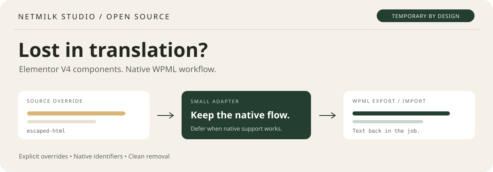
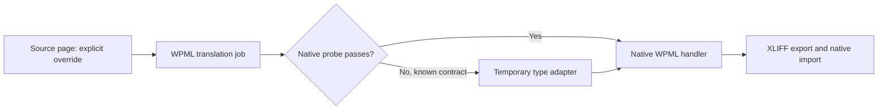

<p align="center"></p>

# WPML Elementor V4 Component Translation Fix

**Component override text missing from your WPML XLIFF export?** This small WordPress plugin adapts explicit Elementor V4 `escaped-html` overrides through WPML's native translation handler, then gets out of the way when native support passes its checks.

[](https://github.com/enuzzo/wpml-elementor-component-fix/actions/workflows/tests.yml)
[](https://github.com/enuzzo/wpml-elementor-component-fix/releases/latest)
[](LICENSE)
[](.github/workflows/tests.yml)

**[Download the installable plugin →](https://github.com/enuzzo/wpml-elementor-component-fix/releases/latest)** · [How it works](docs/architecture.md) · [Guida italiana](docs/README.it.md) · [Report a compatibility issue](https://github.com/enuzzo/wpml-elementor-component-fix/issues/new/choose)

Built by **Netmilk Studio**. Temporary by design, reusable across sites. Independent community project; not affiliated with or endorsed by WPML or Elementor.

**Development status:** this branch contains an **unreleased 1.0.4 candidate**. The latest published release remains [**1.0.1**](https://github.com/enuzzo/wpml-elementor-component-fix/releases/tag/v1.0.1), which covers component overrides only. Follow the [changelog](CHANGELOG.md) for pending changes and [GitHub Actions](https://github.com/enuzzo/wpml-elementor-component-fix/actions/workflows/tests.yml) for results on a specific branch and commit. A green CI run does not certify a live CMS translation cycle.

## What is new in the 1.0.4 candidate?

V4 select options can be registered correctly yet omitted by the native item handler: its collection lookup expects a flat key, and its identifier logic expects an item ID absent from typed options. Candidate 1.0.4 supplies an in-memory collection alias and stable surrogate item IDs derived from unique technical values, then delegates extraction, string naming and import to WPML. It exposes only visible labels for translation; technical values remain unchanged. Duplicate labels stay distinct after reordering. The delegated item extractor includes `"0"` in local checks, but the first live XLIFF exports omit it; blank labels remain omitted.

Native extraction/import probes bypass normalization when the installed handler handles the format correctly. Unknown/custom registrations, ambiguous technical values and identity collisions are not adapted. The component, form-name and master-origin filters are unchanged from 1.0.3. This candidate adds no component-registry synchronization; it allows a fresh select/master/page cycle to establish rendering behavior before any metadata repair. See [select-option behavior and validation](docs/select-option-compatibility.md).

**First live 1.0.4 export — 2026-10-02:** archived English/French/German demo XLIFF files each contain 64 units, including all three human-readable option labels with distinct IDs. The literal zero label has no unit. Its persistence and rendered behavior, along with blank-label behavior, are being checked through native import; omission from XLIFF alone is not yet established as data loss. The frozen candidate remains unchanged while that result is pending.

## Changes retained from 1.0.3 and 1.0.2

Exposing a heading or paragraph as a component property wraps its default text inside `overridable.value.origin_value`. The observed WPML handler already resolves that wrapper for `string` and `html-v3`, but misses `escaped-html`. Candidate 1.0.3 passes an in-memory `string` copy through the native node handler and restores `escaped-html` in its returned update. Original fields, identifiers and metadata remain native; no competing field paths or instance overrides are added. Plain-text and HTML extraction/import probes bypass adaptation when native support works. See [master-origin diagnosis and acceptance](docs/master-origin-compatibility.md).

Some V4 forms store their name as a wrapped string, while WPML's configuration points to the containing value. The candidate adds the text path `form-name>value`, retaining the native identity `form-name` and the previous scalar path. Existing nested registrations, custom integrations and unknown configurations are left alone. The component override adapter is unchanged from 1.0.1.

## Validation and before/after checks

The suite now has 44 synthetic scenarios, including 12 select-option scenarios. Master-origin checks cover native delegation, runtime probes, active-field/cache behavior and conservative fallback. Form-name checks remain configuration-level guards. A separate local diagnostic exercised the installed native node-handler source with environment stubs; it does not certify a WordPress translation cycle. The earlier 1.0.2 package remains frozen, and its [form-name diagnosis](docs/form-name-compatibility.md) records historical test evidence separately.

Before accepting the candidate on a site:

1. Record the installed versions and active adapters, prepare backup/rollback, and capture existing translations and a fresh draft XLIFF export **before updating**.
2. After updating, check those existing translated pages **before any new import** for unintended changes. Isolate the candidate from any local form-name addon during the controlled test so the addon cannot mask its behavior.
3. Generate fresh WPML jobs, verify one name segment per form and stable identities, translate only targets, and import through WPML. Compare rendered texts, markup, links and form names **after import**, including without authentication.
4. Run the [select-option gates](docs/select-option-compatibility.md#site-acceptance) with duplicate labels, unique technical values, `"0"`, blank labels and reordering. Run the separate [master-origin gates](docs/master-origin-compatibility.md#native-test-gates): fresh master exports, native import, raw element tree/registry comparison and inherited-page rendering.
5. Change a source form name, option label and master text, then repeat the cycle. Verify source immutability, preserved wrapper metadata and absence of new duplicate fields; restore the previous configuration if a regression appears.

The candidate's live export/import/render cycle remains unverified. Two cycles were [reported for 1.0.1 plus a separate form-name addon](docs/form-name-compatibility.md#reported-combined-setup-test--2026-10-02), followed by rollback over unresolved inheritance. A later isolated 1.0.2 test reported a master export containing only the document title; no master import was attempted. Neither report validates later candidates. Test master and page jobs separately and compare actual raw bindings before/after native import; do not substitute successful activation or an accepted import for these checks.

**1.0.3 integration progress — 2026-10-02:** with the frozen candidate alone, the site session reported successful fresh master export and native import in English, French and German. Read-only comparison of archived XLIFF/WXR evidence confirmed both origin texts translated with types, keys and element IDs preserved. The dedicated component property registry is missing from the translated masters, and the extended page export omitted select-option labels. That incomplete page export was not imported; the session reported rollback. Full migration acceptance remains open. See the [integration evidence](docs/master-origin-compatibility.md#validation-and-limits) and [metadata/select diagnosis](docs/integration-gaps.md).

## The symptom

You build a reusable Elementor V4 component, override a heading or button label in a page instance, and send the page through WPML. Links may appear in the export, while the overridden text does not. An exported component job may contain only its document title. Translating those available fields cannot translate text that was never exported.

This adapter targets **explicit instance text overrides stored as `escaped-html`**, when the installed native handler understands the corresponding `string` format but misses this value type. It does not register every kind of Elementor field.

## What it changes

| Behavior | Result |
| --- | --- |
| Explicit `escaped-html` text overrides | Exposed through the native WPML extraction/import handler |
| Elementor source data | Adapted in an in-memory copy; original value type restored in the returned update |
| Translation field identifiers and links | Delegated to the installed WPML handler |
| Working native plain-text **and** HTML round trips | Original native handler retained |
| Unknown or incompatible native API | Original configuration retained |
| V4 `e-form` nested name (1.0.2 candidate) | Additional `form-name>value` registration with native `field_id` `form-name`; existing nested/custom registrations retained |
| Direct exposed heading/paragraph master text (1.0.3 candidate) | Native node-handler delegation with temporary type conversion; runtime probes; no registry writes or null/forwarded-binding resolution |
| Typed select-option labels (1.0.4 candidate) | Native item-handler delegation; stable in-memory item IDs; technical values preserved; zero labels included |
| Settings, database tables, frontend scripts, network calls, telemetry | None added |

**WPML still owns the translation job and applies the translation.** The plugin does not independently write secondary-language Elementor pages or translate text itself.



## Install and verify

1. Download **`netmilk-wpml-component-compat-1.0.1.zip`** from [Releases](https://github.com/enuzzo/wpml-elementor-component-fix/releases/latest). Use the release asset; GitHub's source-code ZIP contains the repository, not an installable plugin at its root.
2. In WordPress, open **Plugins → Add New → Upload Plugin**, upload the ZIP and activate **Netmilk — WPML Elementor Component Fix**.
3. Start with a draft source page containing two component instances with different explicit text overrides. Keep a backup and use your normal WPML local-translator workflow.
4. Create **fresh translation jobs**, export XLIFF 1.2, and confirm that the expected source texts are present. Existing exports do not gain missing fields retroactively.
5. Translate the `<target>` values, preserve the sources, identifiers and meaningful markup, then import through **WPML → Translations**.
6. Check the rendered translated page: texts, links, device layouts and inherited properties. An accepted ZIP alone is not proof of a correct page.

This flow needs no Advanced Translation Editor or automatic translation. If a field still does not appear, diagnose the source/property/job before changing anything in a translated Elementor page.

Updates are manual through GitHub release ZIPs. The plugin does not install an updater or poll GitHub.

## Requirements and test coverage

| Layer | Coverage |
| --- | --- |
| PHP | Declared minimum 7.4; CI matrix 7.4, 8.1, 8.3 and 8.5 |
| WordPress | Declared minimum 6.5; WordPress runtime not included in the test harness |
| Elementor | V4 `e-component` instances with explicit `escaped-html` overrides |
| WPML | Existing `WPML\PB\Elementor\V4\Component\Overrides` handler using the supported untyped method contract |
| Regression tests | 44 isolated scenarios with original synthetic doubles, including component behavior, form registration, master origins and select options; 15 scenarios in published 1.0.1 |
| Live CMS certification | **Not yet completed for this public release** |

The implementation was informed by a handler contract observed in WPML 4.9.7. Public tests contain original synthetic examples, **not** WPML vendor code or client exports. CI is a PHP/contract check, not a substitute for a real WordPress + Elementor + WPML export/import/render test.

## Remove it when native support works

The plugin checks native plain-text and HTML extraction/import using synthetic data and caches completed support decisions within the request. Exceptions leave the handler unchanged and allow a later filter call to retry. If both probes pass, it leaves the native handler in place. This is a **bypass**, not automatic deactivation or uninstallation.

After an official update, deactivate the adapter on a test site and run a **fresh** translation cycle against the actual fields you use. If export, native import and the rendered page all work, delete it from Plugins. It owns no persistent data. If native support is still incomplete, future jobs may omit text again after deactivation.

## FAQ

### WPML says Elementor component overrides are fixed. Why another plugin?

The [official component-override erratum](https://wpml.org/errata/elementor-editor-v4-beta-cant-translate-component-property-overrides/) is marked **resolved in WPML 4.9.3**. The [general V4 overview](https://wpml.org/errata/elementor-v4-general-overview/) is marked resolved in 4.9.4. This project addresses a narrower value-format mismatch observed during later integration work. Those statuses do not prove that every component property format works in your installed stack. Use this adapter only when your own fresh export demonstrates the matching symptom.

### Will it translate inherited component defaults?

Not in general. Candidate 1.0.3 adapts direct exposed heading/paragraph `escaped-html` origins through native WPML handling. It does not manufacture instance overrides, resolve null/forwarded bindings, remap masters or synchronize their property registry. The [master-origin candidate](docs/master-origin-compatibility.md) and [inherited-default investigation](docs/inherited-defaults-investigation.md) distinguish this narrow change from full inherited rendering acceptance. The observed native master handler omits empty text and the literal `"0"`; this candidate preserves that behavior and does not claim those cases fixed.

### Will it fix every Elementor V4 button or custom widget?

No. It targets `e-component` override values, nested `e-form` names, direct exposed heading/paragraph origins and the 1.0.4 candidate's typed select-option labels. Other master properties, custom controls, form fields/actions and styling remain outside scope. See [WPML's custom Elementor widget documentation](https://wpml.org/documentation/support/multilingual-tools/registering-custom-elementor-widgets-for-translation/) for a different integration problem.

### Can I reuse it across different sites and languages?

Yes, for the same supported contract and data format. There are no embedded site IDs, domains, media, translation strings or language codes. Verify a draft round trip on each stack before using it for production jobs.

### Nothing changed after activation. What should I check?

Confirm the value is an explicit `escaped-html` override, generate a fresh job, and inspect its XLIFF source fields. The adapter intentionally leaves unsupported contracts, an absent native handler and an existing replacement handler alone. Please [report the exact versions and a minimal synthetic reproduction](CONTRIBUTING.md).

## Development

Start with [Contributor instructions](AGENTS.md) and the [local development and session handoff guide](docs/development.md) for checkout checks, syntax validation, CI inspection and package verification.

```sh
php tests/run.php
python3 scripts/build.py
```

The build uses an explicit payload allowlist and deterministic ZIP metadata. Current candidate output: `dist/netmilk-wpml-component-compat-1.0.4.zip` and `dist/SHA256SUMS`. Packages contain only the PHP entrypoint, WordPress readme and GPL license, inside one plugin folder. Building the candidate does not publish or replace the 1.0.1 release or frozen 1.0.2/1.0.3 packages.

[Contributing](CONTRIBUTING.md) · [Changelog](CHANGELOG.md) · [GPL-2.0-or-later](LICENSE)
